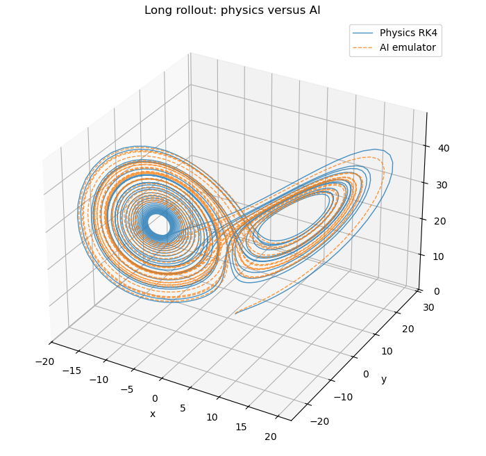

# From Lorenz to AI Weather Models: a Minimal AI Weather Model Testbed

This repository contains a simple and self-contained notebook introducing the Lorenz system, chaotic dynamics, and a neural-network-based emulator trained to reproduce Lorenz trajectories.

The notebook is designed for educational purposes and can be run directly in Google Colab.

## Notebook

The main notebook is located in:

```text
notebook/integrated_notebook_colab_ready.ipynb
```

You can:

* open it directly in Google Colab,
* or download and run it locally.

## Topics covered

* The Lorenz equations and chaotic systems
* Numerical integration with RK4
* Training a neural-network emulator using PyTorch
* Long rollouts and trajectory comparison
* Sensitivity to initial conditions
* Comparing physics-based and AI-based dynamics

## Example result



The figure above compares:

* the reference Lorenz trajectory integrated with RK4,
* and the trajectory generated by the trained neural-network emulator.

Despite being trained only for one-step prediction, the AI model learns important aspects of the underlying chaotic attractor.

## Real-world deterministic chaos example

A useful real-world illustration of deterministic chaos in weather prediction is discussed here:

[Weather and deterministic chaos](https://guidocioni.substack.com/p/christmas-weather?r=70fjqb&utm_campaign=post&utm_medium=web&triedRedirect=true)

This example can help connect the Lorenz-system experiment to practical questions in weather forecasting, predictability, and the rapid growth of forecast uncertainty.

## Requirements

The notebook mainly uses:

```python
numpy
matplotlib
torch
```

These packages are available by default in Google Colab.

## Repository structure

```text
notebook/    -> Main Colab notebook
figure/      -> Figures used in README
```

## Intended use

This material was prepared as a lightweight educational testbed for understanding how AI models learn, approximate, and sometimes diverge from chaotic physical systems.
